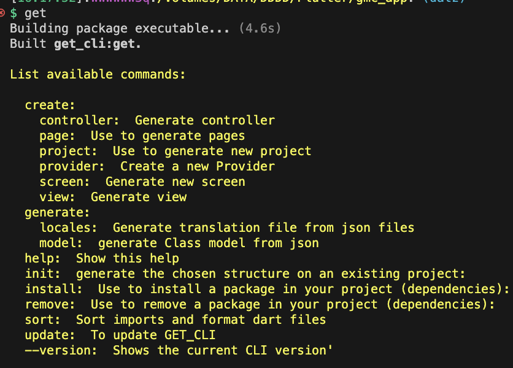
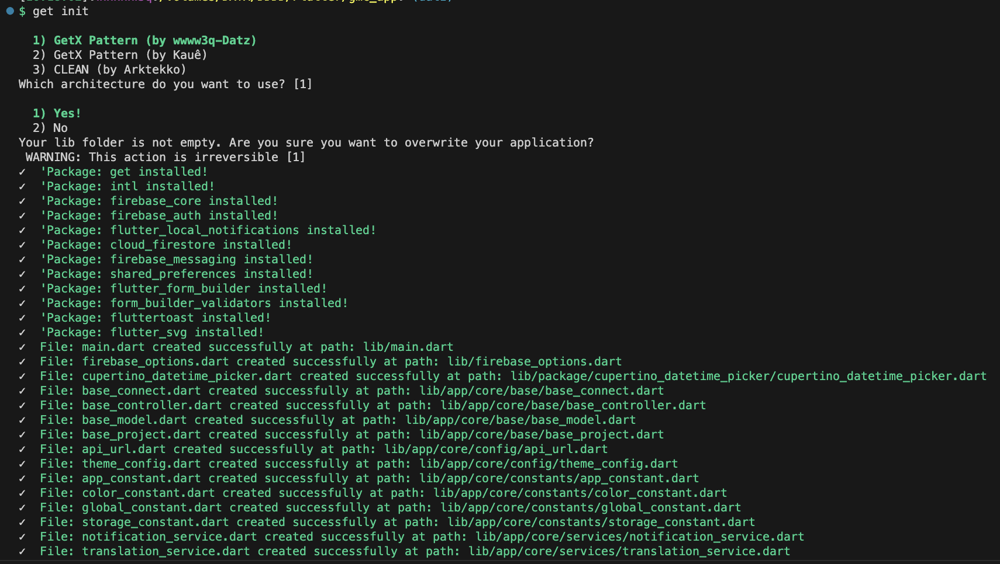
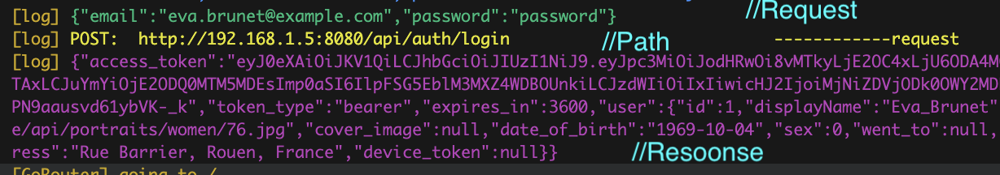
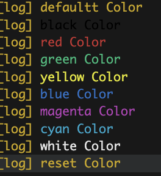
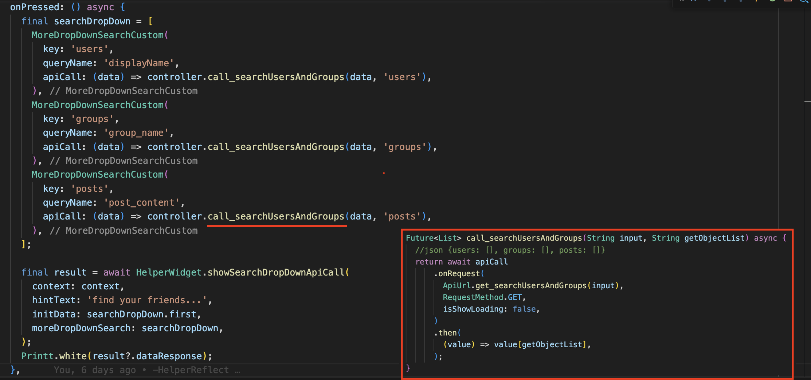

# Flutter GetX Base Project

Dựa theo kinh nghiệm ít ỏi và thời gian dùng GetX của mình, đây là base cấu trúc thư mục, cũng như các package cần thiết/hàm mà mình hay dùng.
Hi vọng sẽ giúp ích được cho bạn!

## 📝 Mục lục

- [Cài đặt](#🛠-Cài-đặt)
  - [Clone từ source này](#Clone-từ-source-này)
  - [Hoặc sử dụng Get Cli](#Hoặc-sử-dụng-get-cli)
  - [Cài FlutterFire](#Cài-FlutterFire)
    - [Cài đặt Get cli](#Cài-đặt-GET-CLI)
    - [Get init](#Get-init)
- [Tính năng](#🚀-Tính-năng)
- [Giao diện](#Giao-diện)
- [Thêm](#Thêm)

## 🛠 Cài đặt

### Clone từ source này

- Copy toàn bộ thư mục lib/ và ghi đè nó vào project của bạn.
- Dựa theo mẫu file `pubspec.yaml` dưới dây bạn copy và chọn lọc tương ứng

```yaml
environment:
  sdk: ">=3.0.0	 <4.0.0"
  flutter: ^3.10.0

dependencies:
  cupertino_icons: any
  get: any
  intl: any
  firebase_core: any
  firebase_auth: any
  flutter_local_notifications: ^14.0.0+1 #nên sử dụng từ phiên bản này trở lên
  cloud_firestore: any #dung de load data notify
  firebase_messaging: any
  shared_preferences: any
  flutter_form_builder: any #bingding form
  form_builder_validators: any
  fluttertoast: any
  flutter_svg: any
  flutter_localizations:
    sdk: flutter
  flutter:
    sdk: flutter

dev_dependencies:
  flutter_lints: ^2.0.1
  flutter_test:
    sdk: flutter

flutter:
  uses-material-design: true
  assets:
    - assets/images/
    - assets/svg/
    - assets/gif/
    - assets/translations/
```

### Hoặc sử dụng Get Cli

#### **Cài đặt GET CLI**

Tải source [Get CLI](https://github.com/wwwwww3q/get_cli_basemodel_generator) mà mình đã tự custom.

Sau khi download xong, mở CommandLine tại vị trí của source Get CLI và gõ theo lệnh:

```bash
dart pub global activate --source path .
```

Nó sẽ tự động sinh ra file `get.bat`, thường thì đường dẫn phát sinh sẽ nằm tại đây:
| Platform | Directory |
| ----------------- | ------------------------------------------------------------------ |
| Window | %USERPROFILE%\AppData\Local\Pub\Cache\bin |
| MacOS | Users\%USERPROFILE%\.pub-cache\bin |

Enviroment của [Get CLI](https://github.com/wwwwww3q/get_cli_basemodel_generator) không tự động cập nhật vào terminal của bạn. Nên lúc này khi lần đầu chạy, bạn phải cấu hình Enviroment cho nó.

#### Window:

1. `Windows+R` và gõ `sysdm.cpl`.
2. Phía trên chọn Tab `Advanced` > click nút `Environment Variables` ở dưới.
3. Màn hình dưới của `System Variables`, tìm chữ `Path` Double-click để mở Edit.
4. Copy đường dẫn Directory ở trên, chọn `New` và dán vào.
5. [Chạy thử](#Bật-CommandLine-lên-chạy-với-quyền-administrator,-gõ-`get`-xem-nó-có-chạy-được-không).

#### MacOS:

Gõ lệnh để thêm Environment

```bash
export PATH="$PATH":"$HOME/.pub-cache/bin"
```

Full code file `.zshrc` của mình được cấu hình như sau:

```shell
export PATH="$PATH:$HOME/Program Files/flutter/bin"
export ANDROID_HOME="$HOME/Library/Android/sdk"
export PATH="$ANDROID_HOME/tools:$ANDROID_HOME/tools/bin:$ANDROID_HOME/platform-tools:$PATH"
export PATH="$PATH":"$HOME/.pub-cache/bin"
export PATH="$PATH":"$HOME/.dotnet/tools"

parse_git_branch() {
  git branch 2> /dev/null | sed -e '/^[^*]/d' -e 's/* \(.*\)/ (\1)/'
}

export NEWLINE=$'\n'
PROMPT="[%F{green}%*%f]:%F{magenta}%n%f:%F{011}%~%f:%F{014}$(parse_git_branch)$NEWLINE%F{010}$%f "
```

để áp dụng terminal chạy với lệnh.

```bash
source ~/.zshrc
```

#### Bật CommandLine lên chạy với quyền administrator, gõ `get` xem nó có chạy được không



Bạn có thể tìm hiểu thêm nếu không rõ... Nội dung này sẽ được update cụ thể sau.

#### **Get init**

chạy lệnh để tạo template project

```bash
get init
```

Nhập con số để tạo mẫu (nhấn enter 2 lần để tạo template của mình)


### Cài FlutterFire

[Tham khảo tại đây để cài FlutterFire CLI](https://firebase.flutter.dev/docs/overview)

Gõ lệnh này để tự động cấu hình config firebase trong 1 nốt nhạc

```flutterfire
flutterfire configure
```

Vậy là xong !.

## 🚀 Tính năng

Lưu ý: mình chỉ liệt kê 1 số cái thường dùng. muốn biết thêm về Get Cli, bạn có thể tham khảo bản gốc [tại đây](https://pub.dev/packages/get_cli)

### **Generate Module**

```bash
get create page:name
```

Lệnh này cho phép bạn tạo các modules nhanh bao gồm bộ 3 [Controller, Binding, View]

Tự động tạo đường dẫn AppPages, AppRoutes

Có thể tạo modules bên trong modules khác

```bash
get create page:name on other_module
```

Khi sử dụng `on` để tạo modules mới, CLI sẽ sử dụng [children pages](https://github.com/jonataslaw/getx/blob/master/CHANGELOG.md#3210---big-update).

### **Generate Model**

```bash
get generate model on response with assets/import_response.json
```

Khi sử dụng template của mình, trong assets có file sẵn `import_response.json`, chỉ việc ném json cần generate model vào đây. Sẽ tự tạo model theo cấu trúc `BaseModel`
Nếu thấy lỗi đỏ file là do thiếu import, cứ bấm gợi ý và chọn auto import file base_model.dart

### **Generate Translation**

```bash
get generate locales assets/translations
```

Lệnh này sẽ tạo ra file chuyển đổi ngôn ngữ dựa theo json.
Để sử dụng chỉ việc LocaleKeys.KeyName.tr
Sử dụng hàm có sẵn mà template này có `TranslationService.changeLocale` để chuyển ngôn ngữ và lưu vào hệ thống

### **API Call**

Tùy chỉnh BaseURL tại `/app/core/config/api_url.dart` > `base_url`

Gọi api đơn giản với hàm `apiCall.onRequest` tại BaseController

```dart
final UsersModel? result = await apiCall.onRequest(
      ApiUrl.post_auth_login(),
      RequestMethod.POST,
      body: {
        'userName': 'foo',
        'password': 'bar',
      },
      baseModel: UsersModel(),
    );
```

Các tham số của `onRequest`

| Type                    | Parameter       | Description                                                                                                                    |
| :---------------------- | :-------------- | :----------------------------------------------------------------------------------------------------------------------------- |
| `String`                | `url`           | **Required**. Đường dẫn api (vd: '/auth/login')                                                                                |
| `RequestMethod`         | `method`        | **Required**. GET, POST, PUT, PATH, DELETE                                                                                     |
| `dynamic`               | `body`          | Có thể truyền vào FormData để gửi hình ảnh, hoặc truyền Map<String,dynamic>, hoặc truyền vào object model có kế thừa BaseModel |
| `BaseModel?`            | `baseModel`     | Khi api trả về, mong muốn parse thành Model nào                                                                                |
| `Map<String, dynamic>?` | `queryParam`    | Thường dùng cho phương thức GET để tìm kiếm                                                                                    |
| `bool?`                 | `isShowLoading` | Muốn hiện loadding ở api này hay không (mạc định true)                                                                         |

Có thể tùy chỉnh UI `LoaddingWidget` tại `/app/custom/widget/loadding_widget.dart`

### **Printt**

Tự động Printt màu của API khi bạn Request và có Response trả về

Sử dụng như hàm `print()` của dart để truyền tham số

```dart
import '/app/core/utils/utils.dart';

void printColor(){
    Printt.defaultt("defaultt Color");
    Printt.black("black Color");
    Printt.red("red Color");
    Printt.green("green Color");
    Printt.yellow("yellow Color");
    Printt.blue("blue Color");
    Printt.magenta("magenta Color");
    Printt.cyan("cyan Color");
    Printt.white("white Color");
    Printt.reset("reset Color");
}
```



### **Search**

Trong `HelperReflect` có sẵn cơ bản hàm Search bạn có thể tham khảo cách dùng dưới đây tại `HelperWidget.showSearchDropDownApiCall`

- Nếu bạn đã có danh sách data có sẵn và chỉ cần filter dựa theo đó, có thể sử dụng `HelperWidget.showSearchDropDown`
- Nếu bạn có api tìm kiếm và phải gọi khi tìm bạn có thể sử dụng `HelperWidget.showSearchDropDownApiCall`

Để tránh việc gọi api liên tục, giới hạn query khi dừng là `1 giây`

Dưới đây mình sẽ ví dụ ở `showSearchDropDownApiCall`:




### **Khác**

Ngoài các tính năng cơ bản trên, bạn có thể tham khảo các hàm hỗ trợ khác:
| Function | Description |
| ----------------- | ------------------------------------------------------------------ |
| LimitRangeTextInput | `TextFormField` có tham số vào là `inputFormatters`, bạn có thể đặt nó ở đây để giới hạn con số người dùng nhập vào |
| Helper.tryFormatDateTime | Thử định dạng chuỗi theo ngày-tháng-năm, trả về nguyên mẫu nếu lỗi |
| Helper.limitShowList | Giới hạn danh sách hiển thị |
| Helper.randomColor/randomNumber | y như ý nghĩa của tên hàm! |
| Helper.listGenerateSeparated | Hoạt động tương tự ListView.separated, chèn phần tử vào giữa các vị trí của danh sách |
| Helper.readFileJson | Đọc file Json của ban5 |
| Helper.containsToLowerCase | So sánh giữa 2 chuổi (thường dùng cho tìm kiem61) |
| Helper.generateIdFromDateTimeNow | Tạo ID theo thời gian hiện tại |
| Helper.convertToListMap | API thường trả về `List<dynamic>`, bạn muốn ép nó sang `List<Map<String,dynamic>>` có thể sử dụng hàm này |
| HelperWidget.showToast | Hiện thông báo nổi (thường dùng cho lỗi api) |
| HelperWidget.highlightOccurrences | Tô đậm chữ tìm kiếm |
| HelperWidget.showSnackBar | Hiện thông báo ở phía dưới (Success ✅/Error X) |
| HelperWidget.buildImage/buildFile | Tạo sẵn widget hiển thị hình ảnh/file (click vào thì phóng to) |
| HelperWidget.showSearchDropDown | phiên bản khác của DropdownButton nhưng có tìm kiếm |

Ngoài ra có `class NotificationService` viết sẵn các hàm cơ bản để push noti.
Cấu hình notify native mình sẽ làm và updat sau này ở 1 commit riêng

## Giao diện

## Thêm

### **Binding**

Bạn có thắc mắc Binding ở GetPage là gì ?
Theo cách mình hiểu đơn giản của GetX

`binding: BindingsBuilder(() => Get.lazyPut(() => HomeController()))`

Nó giống như hỗ trợ xóa Controller sau khi màn hình đó được xóa khỏi Stack, và giúp cho tự khởi tạo Controller sau khi vào Page.
